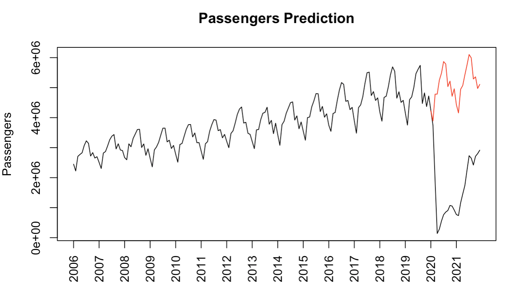

### Luyang Zhang
[Linkedin](linkedin.com/in/luyzh) 
## 1. Multiple Linear Regression Study for Beta-Carotene Level in Human Body 

In this study, we analyzed data from 315 patients in an observational study to understand the relationship between beta-carotene levels and various predictors. Negative associations were found between beta-carotene levels and body mass index and calorie intake. On the other hand, fiber intake and vitamin consumption exhibited positive relationships with beta-carotene levels. A noteworthy interaction was observed between smoking and dietary carotene in determining beta-carotene levels. These findings reinforce known predictors while suggesting new determinants of beta-carotene levels.

_Key Findings_:

Obesity and high calorie intake negatively influenced beta-carotene levels.
High fiber intake and regular vitamin use positively correlated with beta-carotene levels.
Smoking interacted with dietary carotene intake to impact beta-carotene levels.
Results align with previous studies, offering generalizability to diverse populations.

_Importance and Implications_:
These findings guide cancer risk reduction strategies, advocating for healthier lifestyles involving fitness, lower calorie intake, and increased fiber and vitamin consumption. The developed model enables approximating beta-carotene levels using easily accessible information, serving as a valuable tool for identifying high-risk individuals.

_Future Prospects_:
Further studies are warranted to elucidate the mechanisms underlying predictor effects on beta-carotene levels. Exploring specific vitamin impacts is essential. Larger sample sizes should be considered to mitigate sampling variability, improve reliability, and provide more precise predictor-to-beta-carotene relationships.

[View Report Here](https://github.com/luyang-zhang/Data-Science-Portfolio/blob/6786f7f8470c3a1a294646ae3020b0c2561f1ce1/1.%20Multiple%20Linear%20Regression.pdf)

## 2. Examining Variation in Neurons’ Visual Encoding Mean Firing Rate 

_Summary_:
In this project, I delved into the analysis of neural activity in the visual cortex, utilizing data from 1,196 trials conducted by Nicholas A. Steinmetz et al. The primary objective was to investigate the influence of contrast levels and their interaction on neurons' mean firing rates. Additionally, I ventured into predicting mice's reward or penalty responses through logistic regression and linear discriminant analysis models, achieving promising accuracy rates.

_Visual Cortex Analysis_:
Applied a three-way mixed effects ANOVA model to assess the effects of contrast levels and interaction on mean firing rates.
Confirmed that the firing rates of neurons are significantly affected by the contrast levels of visual stimuli and their interaction.
Ensured model reliability through rigorous diagnostics, including residual plots and tests for normality and homoskedasticity.

_Feedback Prediction_:
Employed logistic regression and linear discriminant analysis for predicting mice's reward or penalty responses.
Achieved an accuracy rate of 78% with a True Positive Rate of 97.3% and a False Positive Rate of 76.92% using logistic regression.
Similarly, the Linear Discriminant Analysis model yielded an accuracy rate of 77%, with a True Positive Rate of 95.95% and a False Positive Rate of 76.92%.

_Future Prospects_:
The insights gained from this study underscore my ability to navigate intricate datasets and draw meaningful conclusions. Future avenues could involve more advanced statistical learning tools such as quadratic discriminant analysis or support vector machines. Additionally, refining models through cross-validation and stringent validation criteria can enhance predictive accuracy for feedback types.

[View Report Here](https://github.com/luyang-zhang/Data-Science-Portfolio/blob/4b9d7cf88c919c6bffeb84d0606659278b3b23f9/Examining%20Variation%20in%20Neurons%E2%80%99%20Visual%20Encoding%20Mean%20Firing%20Rate.pdf)

## 3. Prediction Models for NBA Players’ Performance (Neural Networks, Random Forests)

_Summary_:
In this project, we tackled the challenging task of accurately predicting the future performance of NBA players. The accuracy of such predictions is pivotal for a team's success and financial stability. Leveraging clustering and machine learning techniques, we aimed to enhance the understanding of predicting NBA players' success based on their early career statistics.

_Approach_:
We employed a Gaussian mixture model to cluster and label guards and forwards into top, middle, and bottom tier players. The clustering process encompassed player statistics from their fourth season until retirement. To predict a player's tier, we utilized neural networks and random forest classifiers, focusing on statistics from their first three seasons.

_Key Findings_:
Through rigorous experimentation, the random forest classifier demonstrated superior performance over the neural network model. This success is attributed to its heightened ability to predict elite and lower-tier players. Furthermore, our project affirmed the significance of conventional predictors, including points and minutes per game, while also unearthing other insightful predictors for evaluating young guards and forwards.

_Impact_:
This project not only showcases our data science skills but also highlights our ability to tackle complex real-world challenges. By providing valuable insights into the predictability of NBA player performance, this work underscores the potential of data-driven strategies in enhancing team dynamics, success, and financial decisions.

[View Report Here](https://github.com/luyang-zhang/Data-Science-Portfolio/blob/ba952775c700f2812b2ac5c8a03be0bb2fcf1edd/STA%20221%20Final%20Project%20Report.pdf)

## 4. Binary Classification Analysis of Customer Subscriptions (Bayesian Additive Regression Trees, Support Vector Machine, Logistic Regression)

_Summary_:
In this project, we harnessed the growing potential of machine learning in driving business success. We created a binary classification model capable of accurately predicting whether customers would subscribe to a bank’s term deposit product post-marketing calls. Our primary focus shifted to the Bayesian regression additive tree (BART) model among four candidates, including logistic regression, support vector machine, and random forest.

_Approach_:
We explored the merits of BART for this prediction task, delving into its underlying theory and concepts. Our study demonstrated how BART effectively unearthed crucial features beneficial for marketers' campaigns. The BART model achieved impressive results, boasting an area under the curve of 0.802 (95% CI 0.779 − 0.814) and a high accuracy rate of 90.010%.

_Insights_:
We unveiled the role of social and economic factors in influencing individuals' decisions to subscribe to long-term deposits, adding a valuable layer of understanding to marketing strategies.

_Future Directions_:
While our project yielded promising outcomes, we acknowledged the model's limitations. Additionally, we contemplated potential enhancements for leveraging machine learning in the dynamic realm of marketing.

_Impact_:
By successfully implementing a robust predictive model and providing insights into customer behavior, this project showcases our proficiency in utilizing machine learning to address critical business challenges.

[View Report Here](https://github.com/luyang-zhang/Data-Science-Portfolio/blob/bc63fb3b6345d1be691401dd897a8eec53295e8e/Group_5_STA_208_Project.pdf)

## 5. A Time Series Analysis of COVID-19 on Global Travel Patterns at San Francisco International Airport

_Summary_:
This project centers on a comprehensive time series analysis investigating the profound impact of the COVID-19 pandemic on global travel, with a specific focus on San Francisco International Airport (SFO). Leveraging pre-COVID monthly passenger data, the study seeks to quantify the magnitude of the pandemic's disruption on travel patterns and forecast hypothetical passenger volumes in the absence of the pandemic.

_Approach_:
The analysis employs a robust methodological framework, combining time series decomposition techniques with Autoregressive Moving Average (ARMA) models enriched by seasonal and trend components. Spectral analysis serves as a critical validation tool to ensure the fidelity of model assumptions. Through meticulous data exploration and model fitting, the study disentangles the complex interplay of factors shaping passenger numbers at SFO.

_Key Findings_:
The findings reveal a stark narrative of disruption, with the pandemic precipitating a significant loss of approximately 80 million passengers at SFO over the tumultuous years of 2020 and 2021. Notably, the study underscores the resilience of time series analysis in unraveling the intricate dynamics of travel patterns and illuminating the transformative impact of external shocks on aviation hubs.

_Impact_:
This project bears profound implications for stakeholders across the travel industry, offering critical insights into the resilience and adaptability of aviation infrastructure in the face of unprecedented challenges. By elucidating the staggering toll exacted by the pandemic on global travel, the study serves as a potent tool for informing strategic decision-making and policy formulation in navigating the uncertain terrain of a post-pandemic world. As such, it stands as a testament to the transformative power of data-driven analysis in shaping resilient, adaptive, and forward-thinking approaches to global travel management.
